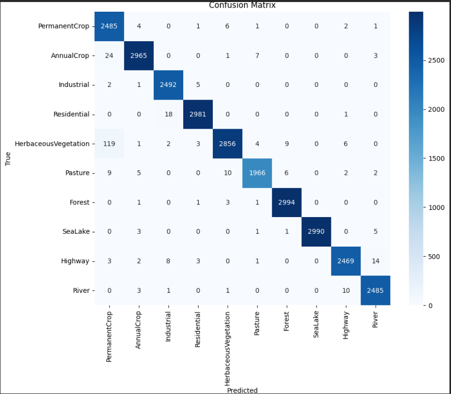
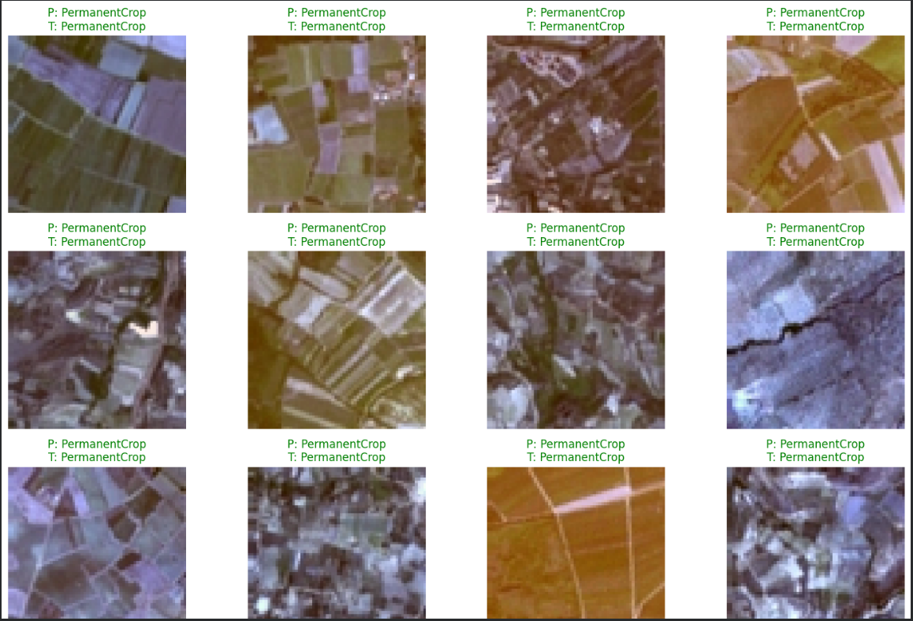
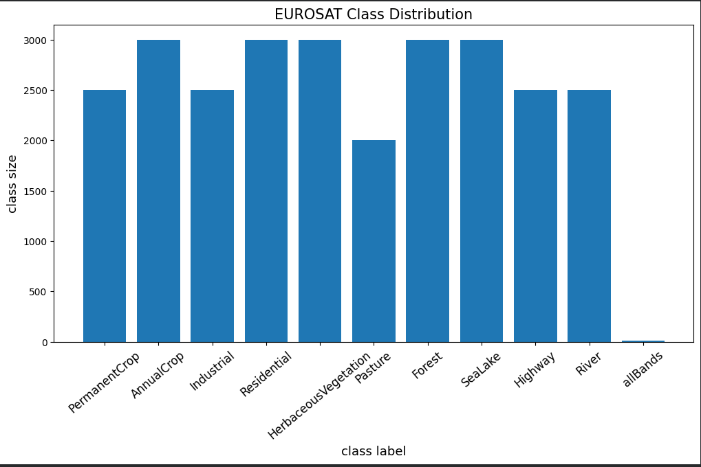

# Satellite Image Classification using ResNet50


## Project Overview

This project implements a satellite image classification system using **ResNet50** and **transfer learning** on the **EuroSAT** dataset. The model learns to classify satellite imagery into 10 different land-use and land-cover categories.

The training process was performed in two stages:

1. **Feature Extraction** using a frozen ResNet50 backbone.
2. **Fine-Tuning** by unfreezing the last 30 layers of ResNet50.

The final model achieved **98.02% validation accuracy**, demonstrating the effectiveness of transfer learning for remote sensing image classification.

---

## Project Pipeline

```text
EuroSAT Dataset
       ↓
Data Augmentation
       ↓
ResNet50 (ImageNet Weights)
       ↓
Feature Extraction
       ↓
Fine-Tuning
       ↓
Classification Layer
       ↓
Prediction
```

---

## Dataset

**Dataset:** EuroSAT

**Classes:**

* Annual Crop
* Forest
* Herbaceous Vegetation
* Highway
* Industrial
* Pasture
* Permanent Crop
* Residential
* River
* Sea/Lake

**Image Type:** RGB Satellite Images

---

## Screenshots

### Confusion Matrix



*Confusion matrix of the fine-tuned ResNet50 model on the EuroSAT dataset.*

### Model Predictions



*Sample predictions generated by the trained model on satellite images.*

### Dataset Distribution



*Class distribution of the EuroSAT dataset used for training and evaluation.*

---

## Model Architecture

* ResNet50 (Pre-trained on ImageNet)
* Transfer Learning
* Global Average Pooling Layer
* Dense Classification Layer
* Softmax Activation

---

## Training Strategy

### Phase 1: Feature Extraction

* All ResNet50 layers frozen
* Trained only the classification head
* Validation Accuracy: **95.37%**

### Phase 2: Fine-Tuning

* Unfroze the last 30 layers of ResNet50
* Reduced learning rate for stable convergence
* Validation Accuracy: **98.02%**

### Training Enhancements

* Data Augmentation
* Transfer Learning using ImageNet pretrained weights
* Fine-Tuning of ResNet50 layers
* Learning Rate Adjustment
* Model Checkpointing

---

## Results

| Training Phase      | Validation Accuracy |
| ------------------- | ------------------- |
| Frozen ResNet50     | 95.37%              |
| Fine-Tuned ResNet50 | **98.02%**          |

---

## Skills Demonstrated

* Deep Learning
* Transfer Learning
* Convolutional Neural Networks (CNNs)
* Computer Vision
* Satellite Image Classification
* Data Augmentation
* TensorFlow/Keras
* Model Fine-Tuning
* Performance Evaluation
* Confusion Matrix Analysis

---

## Technologies Used

* Python
* TensorFlow
* Keras
* NumPy
* Matplotlib
* Scikit-Learn
* Google Colab

---

## Repository Structure

```text
satellite-image-classification/
│
├── resnet50_training.ipynb
├── model_evaluation.ipynb
├── README.md
├── requirements.txt
└── screenshots/
    ├── confusion_matrix.png
    ├── model_predictions.png
    └── dataset_distribution.png
```

---

## Future Improvements

* Compare performance with EfficientNet and Vision Transformers (ViT)
* Perform hyperparameter optimization using Optuna or Grid Search
* Deploy the model using Streamlit or Flask
* Extend to higher-resolution satellite imagery datasets
* Explore ensemble learning techniques
* Implement explainable AI techniques such as Grad-CAM

---

## Key Achievement

Developed a high-accuracy satellite image classification model using transfer learning with ResNet50, achieving **98.02% validation accuracy** on the EuroSAT dataset through data augmentation and fine-tuning of pretrained ImageNet weights.

---

## Author

**Yash Raj Ravi**

B.Tech – Artificial Intelligence and Data Engineering
Indian Institute of Information Technology (IIIT) Kota
